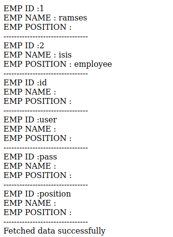
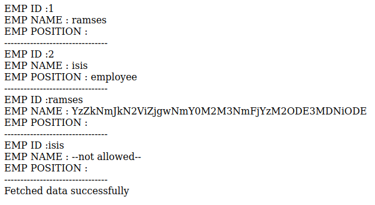
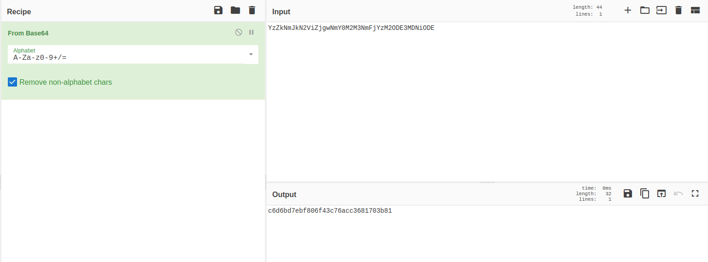
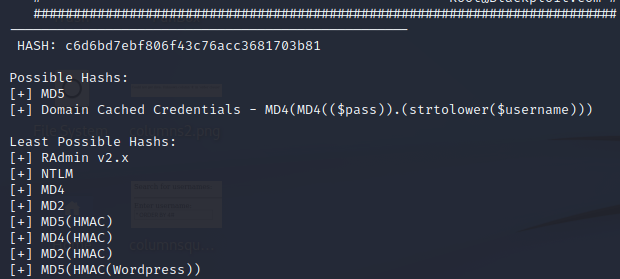

# SQL Injection

We first check if the form is vulnerable to sql injection. We will do that with the tool called SQLMap.

We can see sqlmap has identified the parameter `usrtosearch` to be vulnerable.

We can see that the endpoint is vulnerable to SQLi union query attacks, for these specific types of attacks we must first determine the number of columns required for the table union we can do this by either incrementing the order by index or selecting multiple null columns until the query or application errors out.

First we note on our results that the pound sign is being used in the union query as a comment symbol instead of `--` so we'll use that and we can check how many columns are required, we already know this because the softwae prints out 3 columns but for the sake of learning let's do it ourselves (also because I didn't notice it at the beginning).

Knowing that we can query for databases and then columns for the table users, the following query outputs the table columns and we are interested in the `pass` column.

`" UNION SELECT column_name,null, null FROM  information_schema.columns WHERE table_name='users'#`

We then use this information and build a query that will return all user and passwords from the DB.

`" UNION SELECT user,pass,null FROM users#`

Let's get all users from the mysql server user table too

`" UNION SELECT CONCAT(user, "-", password),null,null FROM mysql.user#`

We then use cyberchef to decode the string for the user ramses from base64 and we check the string with hash-identifier which tells us it's an MD5 hash.

We then use john the ripper to crack the hash.

`sudo john hash.txt rockyou.txt --format=RAW-MD5`

emerald and omega seem like plausible passwords. Let's check the hashes for the mysql users, seems like they are MySQL SHA1 hashes.
